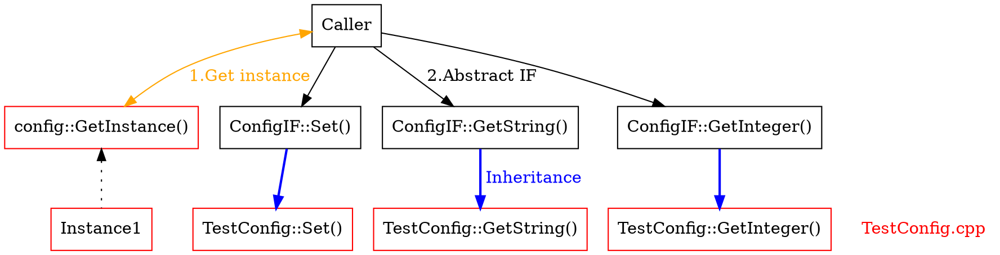
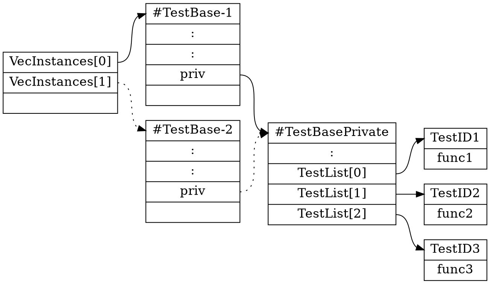

# doxygen/graphviz/mscgen

https://www.doxygen.nl/manual/index.html<br>
https://www.doxygen.nl/manual/commands.html<br>
https://graphviz.org/documentation/<br>
https://www.mcternan.me.uk/mscgen/<br>


- 関数のヘッダだけでなく、ファイルの先頭に説明や図を入れて詳細なドキュメントが作れる
- ソースやヘッダとは独立したページ `@page` を定義し、いろいろ記述したりジャンプできる
- ソースコードの一部を抜粋して、図と合わせて説明可能 [(TestConfig.h)](https://github.com/dogdio/fbt/blob/master/cpp/test-tool/test/TestConfig.h "TestConfig")
- 生成した図から別の図、定義位置などにジャンプできる

```
テンプレートの生成
$ doxygen -g hoge.conf

とりあえず以下を修正すればそれなりの結果が出てくる(htmlだけで良ければlatex=NOでおｋ）
$ vim hoge.conf
  GENERATE_LATEX   = NO
  RECURSIVE        = YES
  EXAMPLE_PATH     = ./dir1 ./dir2

$ doxygen hoge.conf
./html に出力される
```

カスタム方法については以下を参照<br>
https://www.doxygen.nl/manual/customize.html

```
レイアウトをカスタムするには、テンプレートを生成し適宜修正する
$ doxygen -l
./DoxygenLayout.xml が生成される

$ doxygen -w html header.html footer.html customdoxygen.css
./header.html ./footer.html ./customdoxygen.css が生成される
```

設定値いろいろ
```
MSCFILE_DIRS           = ./doc  # mscgenを使う場合はフォルダを指定する

LAYOUT_FILE            = ./doc/DoxygenLayout.xml # カスタムレイアウトファイルを指定

HTML_HEADER            = ./doc/header.html # カスタムheader/footer/cssを指定
HTML_FOOTER            = ./doc/footer.html
HTML_STYLESHEET        = ./doc/customdoxygen.css
HTML_EXTRA_STYLESHEET  = ./doc/customdoxygen.css
```

- [(doxygen-priv.conf)](https://github.com/dogdio/fbt/blob/master/cpp/test-tool/doxygen-priv.conf "doxygen-priv.conf")
- [(doc/)](https://github.com/dogdio/fbt/blob/master/cpp/test-tool/doc "doc")

---

### 箇条書き

`@ref ***` の部分がハイパーリンクになってファイルやクラスに飛べる<br>
`@note` 以外にも、`@pre`, `@post` などがある
```
    ### Operation Overview
    -# Test framework initialization
    -# Parse command line parameters
       - Set configration
    -# Load shared library
       - Install User Instance (see @ref TestSample)
       - Also load any other required libraries here (see @ref TestSample4.cpp)
    -# Traverse Instance queue
       - Registration Tests
       - Execution Tests
    -# UnLoad shared library
    -# exit

    @note
      List of illustrations following (described manually). \n
      Click on the sequence diagram to jump to the next diagram(functions) \n
```


---

### @attention の中に箇条書き等を入れ込む

```
/** @file TestSample4.cpp
    @brief Sample Test class 4
    @attention
    If libSample4.so depend on libSample4Ex.so: \n
    -# When build libSample4.so, you must specify the external depends library (use -l option: -lSample4Ex) \n
    -# you must set Environment variable (please do the following) \n
    ```
    $ export LD_LIBRARY_PATH=./plugin2
    $ ./ExecTest -d ./plugin2
    ```
    @see TestSample4Ex.cpp */
```


---

### 関数コメント1
`@param` で引数、`@retval` で戻り値を記載する

```C
/** verify following test execution conditions
    - @ref CONFIG_TEST_PATTERN_RUN
    - @ref CONFIG_TEST_PATTERN_FROM

    @param[in] tl test target(test-ID and test func)
    @param[in,out] from_ok flag that satisfies CONFIG_TEST_PATTERN_FROM
    @retval true test is executable
    @retval false test is not executable(skip this test) */
bool TestMain::IsTestExecutable(TEST_LIST &tl, bool &from_ok)
```


CALLER_GRAPHがYESの場合のみ、コーラーグラフが表示される(上図はDEPTH=3)<br>
呼び出し元が完全に表示されていない場合は、一番左の関数が赤色になる
```
CALLER_GRAPH           = YES     # default: NO
MAX_DOT_GRAPH_DEPTH    = 3       # default: 0
```

---

### 関数コメント2
`@mscfile` で記述したシーケンスが画像として表示される<br>
画像に表示された関数名などはクリック可能でジャンプできる

```C
ヘッダファイル
/** Called once for registration your test code \n
    please call Register() many times \n
    @retval true test will be processed
    @retval false test is not processed

    @mscfile Regist.msc "regist sequence" */
virtual bool RegisterTests(void) = 0;

実装側(コメントなし)
bool TestSample::RegisterTests(void)
{
	Register("1.1.1", test_1_1_1);
	Register("1.1.2", test_1_1_2);
	Register("1.1.3", test_1_1_3);
	return true;
}
```


下記の設定がYESの場合のみ、ソースコードが展開される
```
INLINE_SOURCES         = YES
```

◆mscgen(*.msc)の書き方<br>
`|||` 1行開ける(実線)　
`...` 1行開ける(点線)　
`=>` 矢印(実線)　
`>>` 矢印(点線)　
`url` ジャンプ先(@ref)を定義　

```dot
msc {
  A[label="TestFramework"], B[label="YourCode"];

  |||;
  A box A [label="Test Registration", textbgcolor="#ccffcc"];
  A=>B [label="RegisterTests()", url="@ref test::TestBase::RegisterTests"];

  |||;
  A<=B [label="Register()", url="@ref test::TestBase::Register"];
  A>>B [label="return"];
  A<=B [label="Register()", url="@ref test::TestBase::Register"];
  A>>B [label="return"];

  ...;

  |||;
  A<<B [label="return"];
}
```

---

### テーブル

```
    Option|Init value  |Config-ID                |Description
    ------|------------|-------------------------|-----------
    -l    |"./test.log"|CONFIG_LOGFILE           |log file name
    -d    |"./plugin"  |CONFIG_DIRECTORY         |DLL search path
    -n    |1           |CONFIG_LOOPNUM           |test loop number
    -s    |""          |CONFIG_TEST_PATTERN_RUN  |Test pattern to run
    -u    |""          |CONFIG_TEST_PATTERN_UNTIL|Do test until specified pattern
    -f    |""          |CONFIG_TEST_PATTERN_FROM |Do test from specified pattern
    -e    |off         |CONFIG_FAIL_AND_EXIT     |if test failed, exit test sequence
    -t    |off         |CONFIG_ADD_TIMESTAMP     |add timestamp to the log
```


---

### ページを定義して、そのページにジャンプ
`@page` でページを定義できる。ページ内に手書きの図、説明などを入れることが可能。

```
    ### Sequence diagram
    - @ref page10      ★
      -# @ref page11
      -# @ref page12
      -# @ref page13

    @cond SECTION_PRIVATE
      ### Block diagram
        -# @ref page01    ☆

      ### Data structure
        -# @ref page02
    @endcond

/** @page page10 All Sequence  ★
    @mscfile All.msc "All sequence"
    @see test::TestBase */

/** @cond SECTION_PRIVATE
      @page page01 Modules Overview    ☆
      @dotfile TestMain.dot
      @see test::TestMain
      @see test::TestBase
    @endcond */
```

◆以下の設定が有効な場合のみ、上記の `@cond` ～ `@endcond` の領域が展開される
```
ENABLED_SECTIONS       = SECTION_PRIVATE
```


---

### ソースコードの内容を一部抜粋する
`@dontinclude` で指定したファイルの一部を取り込める<br>
`@skip` で指定した文字列から、`@until` で指定した文字列が見つかるまでが対象範囲となる<br>
変数などはジャンプ可能。

```
  - @ref TestBase.cpp
    @dontinclude TestBase.cpp
      @skip namespace {
      @until };
```


◆ `@snippet` を使う場合<br>
下記を読み込む側のコメントに記載する（同一ファイル内で読み込みは可能）。<br>
```
@snippet TestConfig.h Snippet1                            
```

読み込まれる側(TestConfig.h)に目印をつけておく
```
//[Snippet1]
     :
     :
//[Snippet1]
```


---

### dotfileサンプル(TB: top to bottom)
`rankdir` が `TB` だと下に向かって進む<br>
`URL=***` の部分に、`@ref` を使えばリンク可能な図となる
（anonymousな空間の場合はちょっと長くなる）<br>



---

### dotfileサンプル(LR:left to right)
`rankdir` が `LR` だと右に向かって進む<br>
データ構造を描くときは `shape="record"` とする。
各要素には先頭から `f0`, `f1`, `f2`,,, のようにしてアクセスする。




---

### mscgenサンプル(シーケンス図から別のシーケンス図にジャンプする)
`label` の部分に `url` を記述することでジャンプ可能となる
(`Initialization` の部分をクリックすると、`page11` にジャンプする)<br>

```dot
msc {
  A[label="TestFramework"], B[label="YourCode"];

  |||;
  A box A [label="invoke ./ExecTest", textbgcolor="#ccffcc"];

  |||;
  |||;
  A:>B [label="Initialization", url="@ref page11"];   ★
  A<<B;

  |||;
  |||;
  A:>B [label="Test Registration", url="@ref page12"];
  A<<B;

  |||;
  |||;
  A:>B [label="Test Execution", url="@ref page13"];
  A<<B;
}

page11 については、doxygenコメントとして別途定義しておく(Init.mscの内容が表示される)
/** @page page11 Init Sequence   ★
    @mscfile Init.msc "init sequence"
    @see test::TestBase */
```


★ Init.msc (Initialization のジャンプ先の `page11` で表示される)<br>
この中で `url=@ref ...` を使ってさらに別の関数にジャンプできる

```dot
msc {
  A[label="TestFramework"], B[label="YourCode"];

  |||;
  A box A [label="Initialization", textbgcolor="#ccffcc"];
  A:>B [label="dlopen"];

  B note B [label="invoke constructor()", textbgcolor="#ffffcc", url="@ref TestSample::TestSample"];
  |||;
  A<=B [label="AddBaseQueue()", url="@ref test::TestBase::AddBaseQueue"];
  A>>B [label="return"];

  A<<B [label="return(dlopen)"];
}
```


